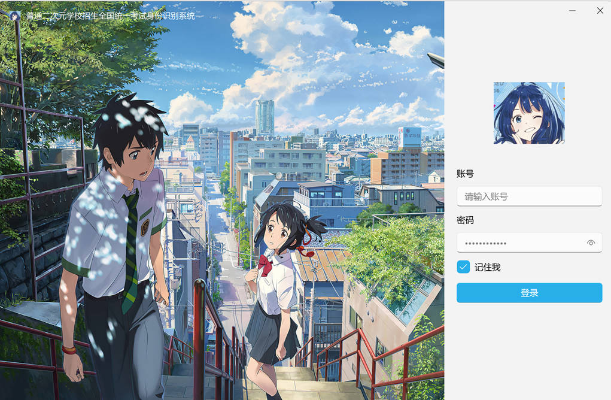
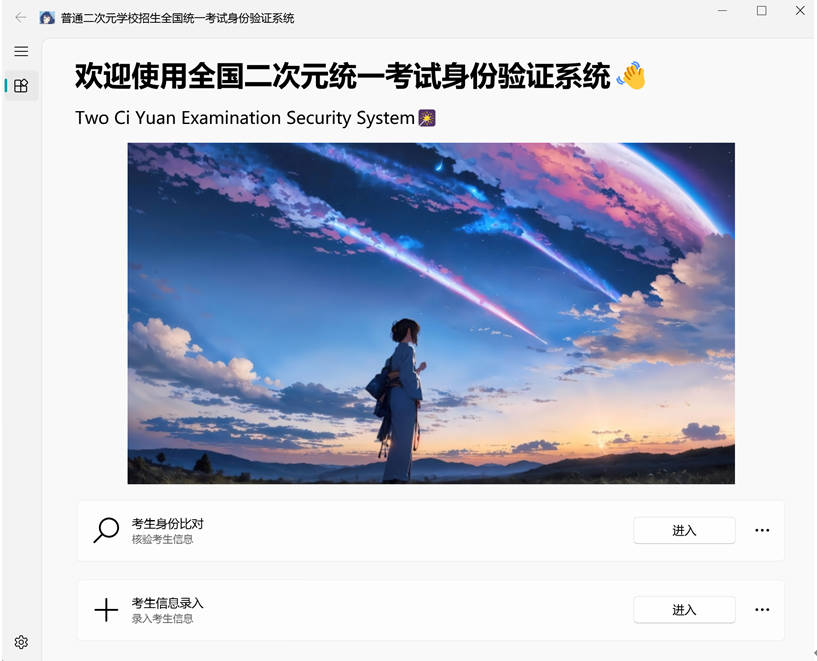
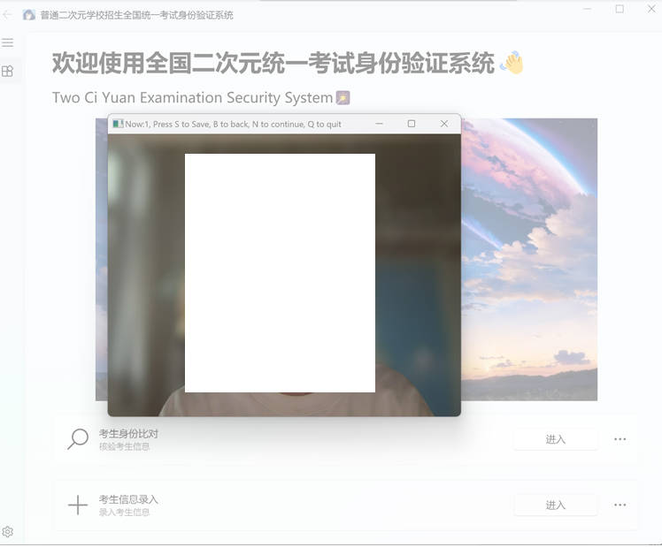

# Exam Identity Verification System via Face Recognition

[](https://www.python.org/)
[](https://opencv.org/)
[](https://riverbankcomputing.com/software/pyqt/)

This repository contains an exam identity verification system based on face recognition.

## ✨ About The Project

**Please Note:** This project was developed primarily as a hands-on learning exercise. It implements the classic, and now somewhat dated, **LBPH** face recognition algorithm to demonstrate fundamental concepts. It serves as a practical application of traditional computer vision techniques rather than a production-ready system using state-of-the-art models.

The system is a desktop application designed for exam identity verification. It uses the **LBPH (Local Binary Patterns Histograms)** algorithm, a classic, texture-based recognition method known for its high efficiency and low resource consumption, making it ideal for quick and lightweight identity checks.


## 🚀 Key Features

* **Secure Admin Login**: Features a secure login interface for administrators with a "Remember Me" function for convenience.
* **Efficient Face Management & Verification**: Supports continuous real-time capture of face data and uses a Haar Cascade classifier with the classic LBPH algorithm for fast and reliable identity verification.
* **User-Friendly GUI**: Built with PyQt5 and PyQt-Fluent-Widgets to provide a clean, modern, and intuitive user experience.


## 📸 Screenshots

<table>
    <tr>
        <td align="center"><b>Admin Login</b> </td>
        <td align="center"><b>Main Menu</b> </td>
    </tr>
    <tr>
        <td></td>
        <td></td>
    </tr>
    <tr>
        <td align="center"><b>Face Data Capture</b> </td>
        <td align="center"><b>Face Verification</b> </td>
    </tr>
    <tr>
        <td></td>
        <td></td>
    </tr>
</table>


## 📦 Getting Started

### 1. Prerequisites

This project uses an OpenCV Haar Cascade classifier for face detection. You need to download the pre-trained model file `haarcascade_frontalface_default.xml`.

* **Download Link**: [**haarcascade_frontalface_default.xml**](https://raw.githubusercontent.com/opencv/opencv/master/data/haarcascades/haarcascade_frontalface_default.xml)
    *(Right-click the link and select "Save Link As..." to download the file.)*

* **Action**: Place the downloaded `haarcascade_frontalface_default.xml` file in the **app/common/classifier directory** of this project, or ensure your code correctly points to its location.

### 2. Installation

**a. Clone the Repository**

```bash
git clone [https://github.com/qingyangxi/ExaminationAuthSystem.git](https://github.com/qingyangxi/ExaminationAuthSystem.git)
cd ExaminationAuthSystem
```

**b. Create and Activate a Virtual Environment**

```bash
# Create the virtual environment
python -m venv venv

# Activate on Windows
.\venv\Scripts\activate

# Activate on macOS/Linux
# source venv/bin/activate
```

**c. Install Dependencies**

```bash
# Install all required packages
pip install opencv-python opencv-contrib-python "PyQt-Fluent-Widgets[full]"
```

### 3. Run the Application

```bash
python main.py
```


## ⚠️ Known Issues

* **UI Layout**: The interface layout may have minor alignment issues on different screen resolutions.
* **Manual Cleanup Required**: After each use, all files within the `app/common/features` and `app/common/images` directories must be deleted manually. Failure to do so will cause errors on the next run due to residual data.
